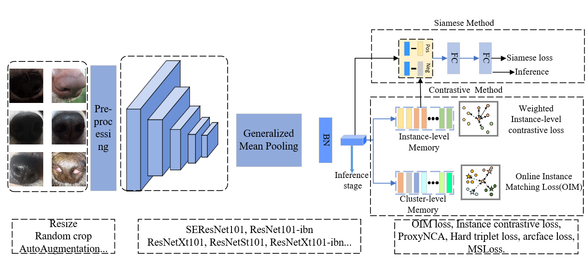

# Code for pet biometrics challenge


The method details are described in our [report](https://github.com/dashengge/pet-biometrics/blob/main/report.pdf)
## Requirements

- Linux or macOS with python ≥ 3.6

- PyTorch ≥ 1.6

- [yacs](https://github.com/rbgirshick/yacs)

- Cython (optional to compile evaluation code)

- tensorboard (needed for visualization): `pip install tensorboard`

- gdown (for automatically downloading pre-train model)

- sklearn

- termcolor

- tabulate

- [faiss](https://github.com/facebookresearch/faiss) `pip install faiss-gpu`

- for conda

  ```
  conda create -n fastreid python=3.8
  conda activate fastreid
  conda install pytorch==1.7.1 torchvision tensorboard -c pytorch
  pip install -r docs/requirements.txt
  ```

We use GPU 3090 for training and testing. The cuda version is 11.1, torch version is 1.7.1, the python version is 3.8.8.

## Prepare Dataset
Download the competition datasets pet_biometric_challenge_2022, and then unzip them under the directory like
```
datasets
├── pet_biometric_challenge_2022
│   └── train
│   └── validation
│   └── test
```
## Prepare Pre-trained Models

We have trained 8 models, and you can download the pre-trained model form this link: 链接：https://pan.baidu.com/s/1Z3PZLIer8S7U_NdCihgm9A 提取码：bauk. Then you should save it under the path of logs. The file tree should be like as:
```
logs
└── resnet101
    └── config.yaml
    └── model_final.pth
```
## Test
You can get the final submit.csv by runing:

```
bash predict.sh
```

It will generate submit.csv in the root dir, which is the final ensemble result. The test process takes approximately 20mins.

## Training

```
bash train.sh
```

We train our model through three stage. Stage1 train the original dataset with 224 resolution by different losses , backbone and batchsize. Stage2 finetune the trainset with 384 resolution which is  inspired by **[kaggle-landmark-2021-1st-place](https://github.com/ChristofHenkel/kaggle-landmark-2021-1st-place)**. Stage3 finetune the model with trainset and validation set which is assigned with pseudo labels. The training process takes approximately 64 hours.

To simplify, you can also train stage 1 alone, which can achieve 88.6% AUC on test set with a single model.


## Conclusion

